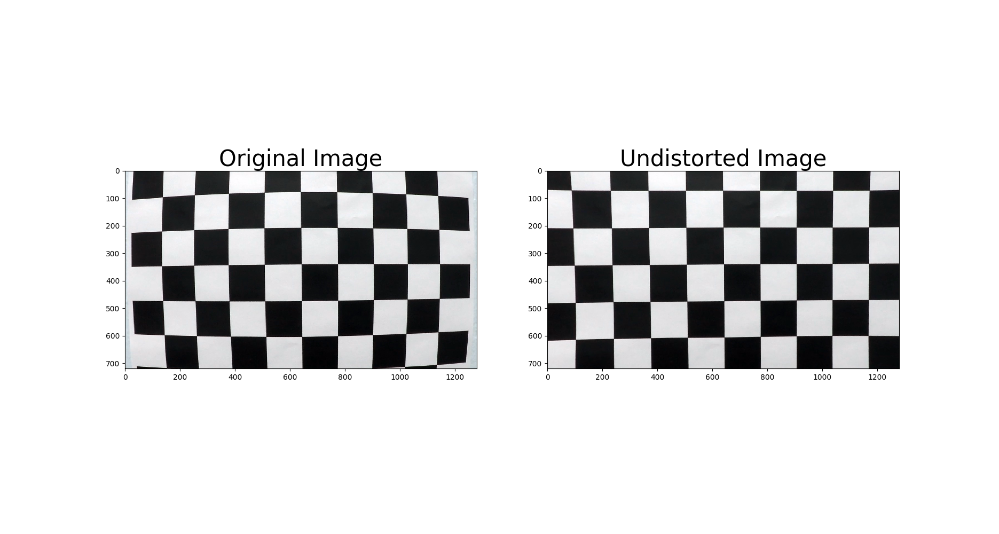
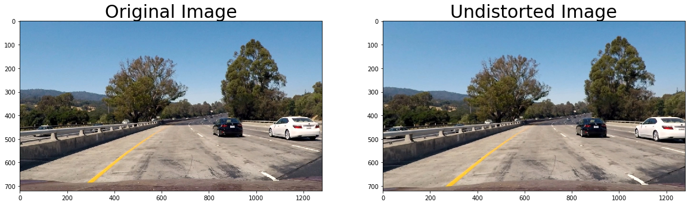
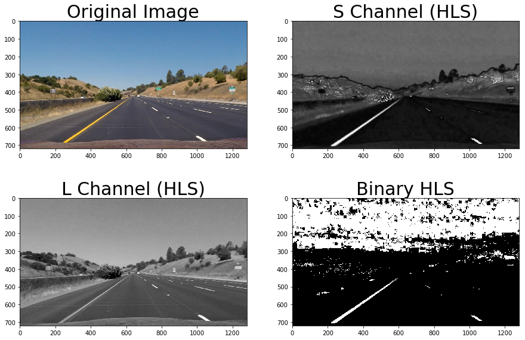
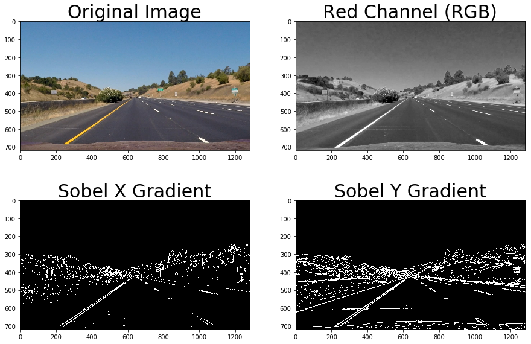
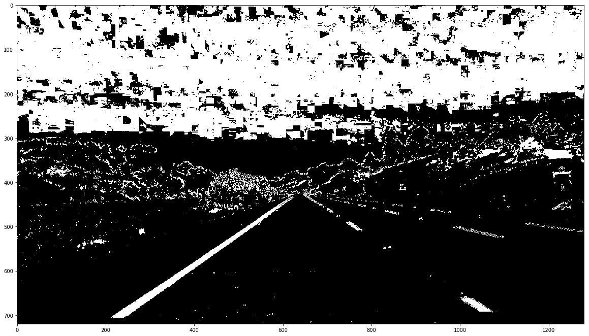
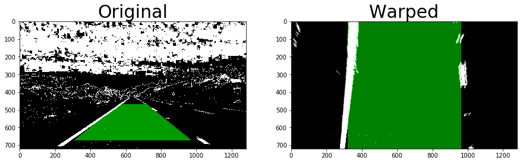
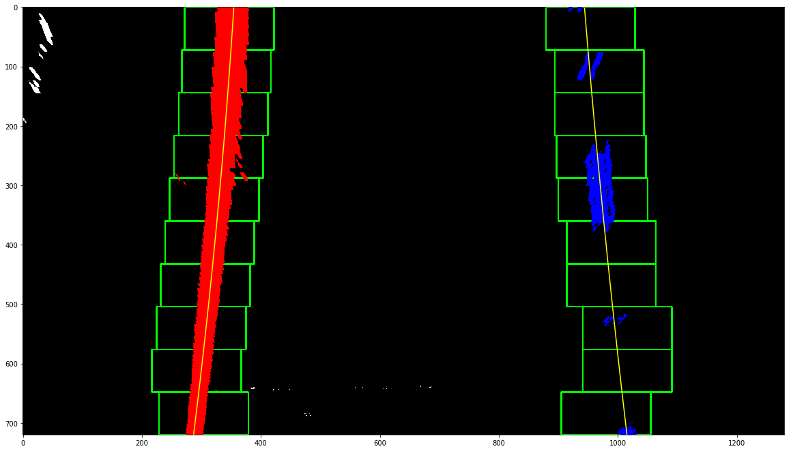
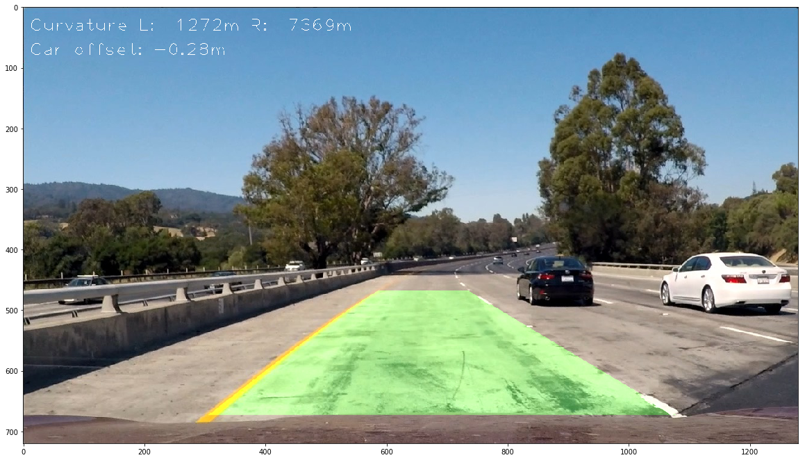

## Advanced Lane Finding

The goal for this project is to write a robust pipeline to identify lane boundaries on a video. 

The main steps are:
 
* Compute the camera calibration matrix and distortion coefficients given a set of chessboard images
* Apply distortion correction to raw images
* Use color transforms, gradients, etc., to create a thresholded binary image
* Apply perspective transform to rectify binary image ("birds-eye view")
* Detect the lane boundary
* Determine the curvature of the lane and vehicle position with respect to center
* Warp the detected lane boundaries back onto the original image
* Output visual display of the lane boundaries and numerical estimation of lane curvature and vehicle position

Camera Calibration:
---

Given the nature of modern cameras lenses and how a 3D environment is mapped into 2D coordinates, 
pictures (or video frames) tend to be distorted (especially on the image borders). 
We can calculate the distortion coefficients of a given camera by 
analyzing a set of pictures taken by such camera. To do so, we need an image with a well defined pattern - 
for instance, a chessboard. In this project we're using 20 pictures of a 9 x 6 chessboard.

Code for the discussion below is at <code>camera_calibration.py</code>.

For each of these images, we determine where the 2D coordinates of chessboard corners are. 
This info is stored in <code>imgpoints</code>. We also create an auxiliary data structure 
(<code>objpoints</code>) to store the 3D coordinates indices of the detected corners (x,y,z). 
In this scenario, our z coordinate is always zero.
 
With this data in hand, we can use OpenCV to calculate the distortion matrix and coefficients of 
our camera. We also use OpenCV to undistort an image:

Once we calculated the calibration coefficients, we store them on a pickle file for use in the 
video processing pipeline.

Pipeline:
---

#### Correcting distortion (<code>LaneFinder.process_frame</code>)

Before we do anything useful with regards to detecting lane markers, we'll first correct distortion. 
This is straightforward once we have the calibration coefficients. Notice how the image corners are 
stretched in the undistorted image:
 

#### Applying image transformations (<code>LaneFinder.process_frame</code>)

In the implemented pipeline two different color spaces are used. 

First, the undistorted image is transformed to the HLS color space.
The saturation and lightness channels are then used to create a binary image. The S 
channel provides a good way to detect vibrant colors (like the yellow and white used for lane markers) 
and the L channel provides a good way to remove very dark regions (where we likely have no interesting 
features).
 

In some situations, the technique above is not sufficient to get a robust identification of the markers.  
After experimenting with different color spaces and separate color channels, I decided to use the red 
channel from the RGB color space. It has shown to perform well in situation where the L and S 
combination from before did not. 
I use the R channel along with Sobel convolutions to create a binary image like the following:
  

  
The results from Binary HLS, Sobel X and Sobel Y gradients are then combined:

#### Perspective transform (<code>image_processing.perspective_transform</code>)

It's much simpler to properly detect lanes if we are seeing the road from 
the top (as a bird would). Instead of converging to the center of the field of vision, lane markers 
on the road would be perfectly (or close to) parallel.

With this in mind, in this step a perspective transform is applied to change from the "car point of view" 
to a birds-eye view. This is done by selecting 4 points in our image that make up a rectangular plane in
the 3D world and 4 target coordinates to where we'll map the plane (a "proper" rectangle). We 
then use OpenCV's <code>cv2.warpPerspective</code> to produce an image like the following (the green regions are 
the source and destination rectangles, respectively):
 

 
#### Lane detection
 
Lane detection is performed using one of the following two techniques 
(<code>LaneFinder.find_lanes_histogram</code> and <code>LaneFinder.find_lanes_poly_fit</code>).
  
If there's no previous lane information (or lost track of the lanes):
  
  * Calculate a histogram for the half bottom of the image
  * Split the histogram into two vertical regions (the left slice will be used for the left lane markers, the right 
  slice for the right lane markers)
  * Find the peak of the histogram in the slice, use this position as a starting horizontal coordinate
  * Split the slice into 10 horizontal slices and for each of them, starting with the bottom-most:
    * Center a window of width 76px over the previous horizontal center position (or the histogram peak for the first window)
     * Find all active pixels in that region
     * If the number of pixels found is above the threshold (50):
        1. calculate the median X position and set it as the new center
        2. Store the pixels coordinates for further processing
  * Once all windows have been processed, fit a second order polynomial regression to the selected 
  pixels (this is then the lane marker model) 
  
If reliable lane markers were found for the previous frame:

  * Define a region of interest around previous lane markers (plus a margin)
  * Discard pixels outside this region
  * Perform a search using windows centered on the previous markers
  * Fit a new polynomial around the selected pixels

The region of interest step is especially useful when the binary image is too noisy.

In the image below it's possible to see the detected left (red) and right (blue) lane pixels, the 
sliding windows from the histogram method (green boxes) and the polynomial fit for each lane marker
(in yellow):

Under challenging conditions, the algorithm might fail to properly detect lanes. Some 
sanity checks are performed to capture failure situations:

1. No left or right marker was detected
2. Left and right markers cross
3. From one frame to the next, markers position shift more than a given threshold
4. Left and right markers have opposed curvatures

Depending on how severe is the failure, lane markers are recalculated from scratch or lane 
markers from the previous frame are used. Implementation details can be seen in <code>LaneFinder.verify_markers</code>

#### Lane curvature and car position
 
Given a second order polynomial, we can calculate the curvature radius following the 
guidelines from this tutorial: [Radius of Curvature](http://www.intmath.com/applications-differentiation/8-radius-curvature.php).
To avoid too much jitter in the measured radius of curvature, frame curvature is an average from the previous 
15 measurements (0.6s). Refer to <code>LaneMarker.curvature_radius</code> for implementation details.

Calculating the position of the car is also simple if we make some assumptions. 
Let's consider that lanes have always the same width and that 700 pixels in the horizontal 
direction correspond to 3.7 meters in the real world. Let's also consider that the camera is mounted in 
the very center of the car. That given, I'm using the bottom of the image (where we have more certainty 
about the lane position) to calculate the lane offset with regards to the camera (and thus the car). 
Using the pixel to meters factor and the perspective transform factor, 
one can easily calculate the car offset in meters. 
Implementation details can be found at <code>LaneFinder.car_offset</code>.

#### Annotating lane info and reverting perspective transform

We can now annotate the lane on the warped image (<code>LaneFinder.annotate_lane</code>: 
<code>cv2.fillPoly</code> comes to the rescue). If we sense that the car is leaving its lane, a lane 
departure warning is issued (the lane is colored red).
 
Once that's done, all that is left to do is to apply the reverse perspective transform and add text 
information to the video frame:

Conclusion:
---

The final results can be seen in the following videos:

[Project video](./output_videos/project_video.mp4)

[Challenge video](./output_videos/challenge_video.mp4)

Overall, the implemented pipeline can deal with lane keeping on highways with no major problems. In more  
complex scenarios, some improvements are necessary.  

#### Limitations

Successive sharp curves can be problematic as it's not possible to model them with a second order polynomial. 
One possible approach is to use a third degree polynomial to model these situations. This requires a  
very robust image pre-processing, however: too much noise and we'd get very "interesting" shapes  
for the lanes. The histogram approach is also not bullet proof in roads with very sharp turns.

Poor lighting is also challenging. Here, some smart brightness adjust might prove 
beneficial. Attempts to correct using hardcoded strategies proved inefficient, but some sort of adaptive 
brightness adjust might be of help. A better color selection algorithm might also help mitigate 
the problem.
